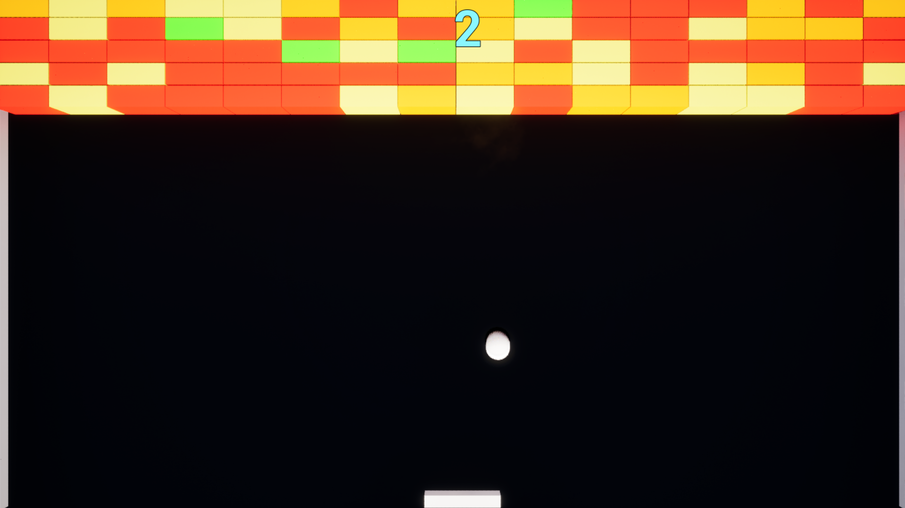

# CasseBrique

## Project Overview

CasseBrique is a game project built using Unreal Engine 5.3. The project includes various assets and configurations to create a brick-breaking game.

## Features

- **Actors**: Includes various actors such as `BP_Ball`, `BP_Brick`, `BP_Paddle`, `BP_Wall`, and `BP_WallEnd`.
- **Characters**: Contains character assets like `Mannequin_UE4`.
- **Maps**: Includes game maps such as `NewMap.umap`.
- **Materials**: Various materials for game assets.
- **Physics**: Physics configurations and assets.
- **Sounds**: Sound assets for the game.
- **Widgets**: UI elements and widgets for the game.
- **Starter Content**: Includes starter content for quick setup and prototyping.